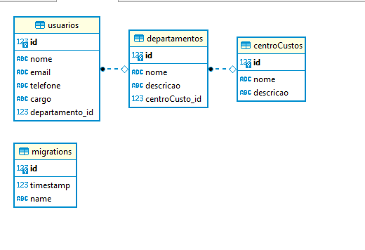

## Desafio Diário do Trader

Para esse desafio foi utilizado o framework [Node.js](https://nodejs.org/en/) com Typescript e [TypeORM](https://typeorm.io/#/)

## Rodar aplicação

0. Bibliotecas Utilizadas no projeto:
- git
- Npm
- Node.js
- Express
- Typescript
- Ejs
- TypeORM
- PostegreSQL
- Yarn

1. Clonar esse repositório:
   `$ git clone https://github.com/GabrielChagas1/TesteDiarioTrader.git`

2. Entrar na pasta do projeto:
   `$ cd TesteDiarioTrader/`

3. Instalar as Dependências:
   `$ yanr install`

4. Criar um banco de dados dentro do PostgreSQL:
    ` É importante esse passo, pois se não tiver um banco de dados, o projeto não vai rodar`

5. Alterar o arquivo .env com os dados do PostgreSQL:
   `Host, user, password e o nome do banco de dados para criar a conexão com o banco de dados`

6. Rodar Migration para criar as tabelas e os relacionamentos no banco de dados:
   `$ yarn migration:run`

7. Rodar Projeto:
   `$ yarn dev`

8. Acessar o painel de controle no navegador
    ` http://localhost:3333`

**Será executado em** `localhost:3333`
_Exemplo:_ : `http://localhost:3333/`

## Diagrama de entidade de relacionamento

